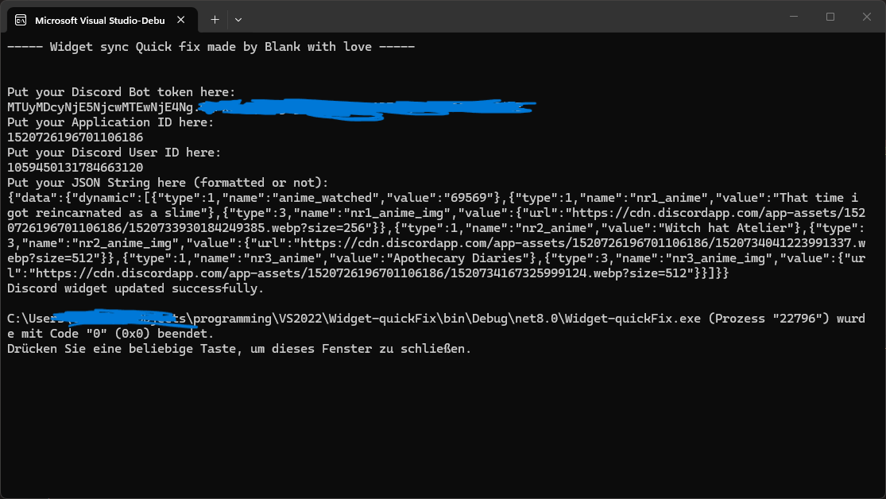

# Discord Widget "quick fix"

## Console Showcase

## Usage
Put your token, appid, userid and formatted json string into this and your widget syncs with the json-information you've provided.

yes it has to be formatted

otherwise there is the executable folder where you can just run it or the source code in the Widget-quickFix folder

OK BYEEEEE